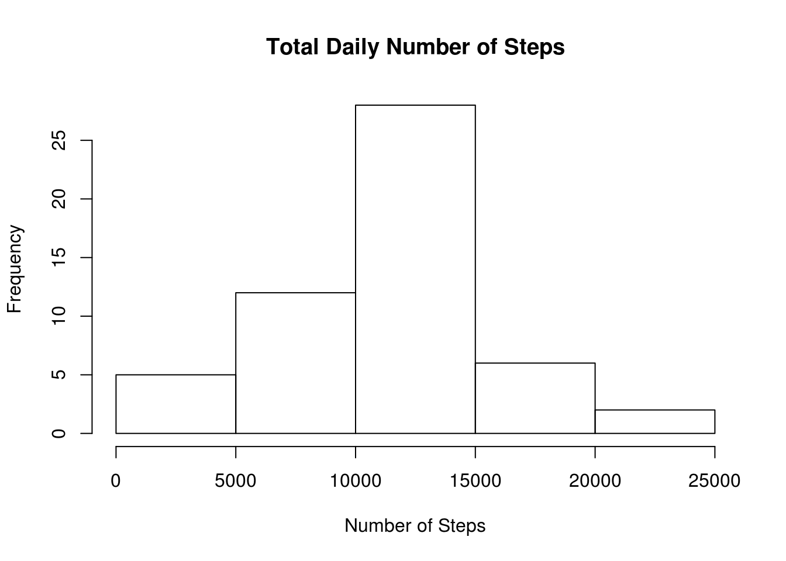
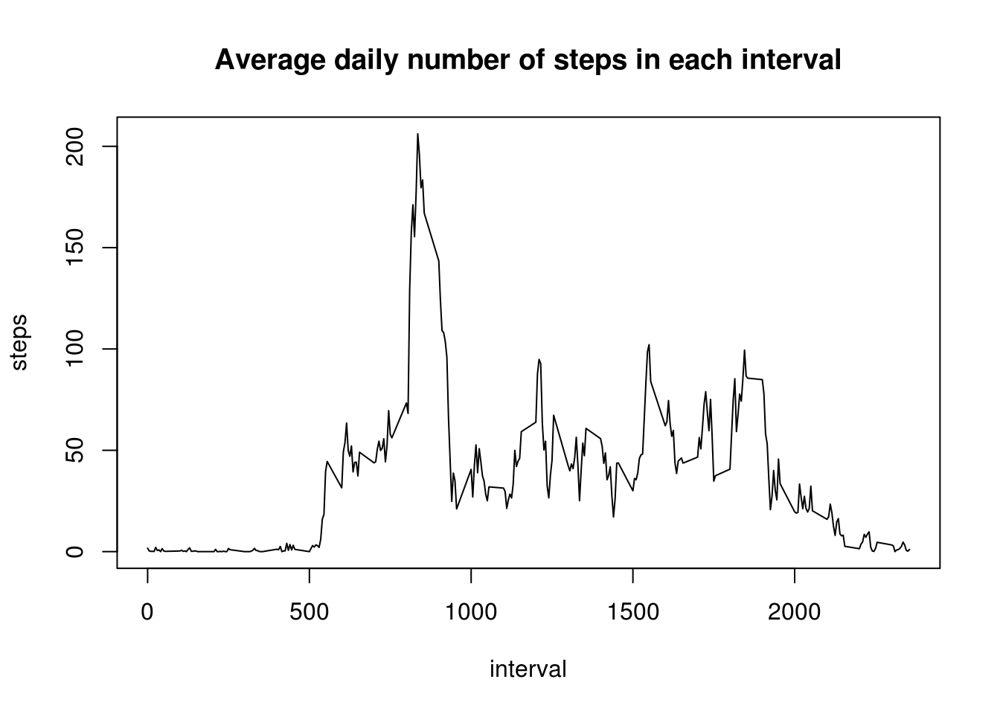
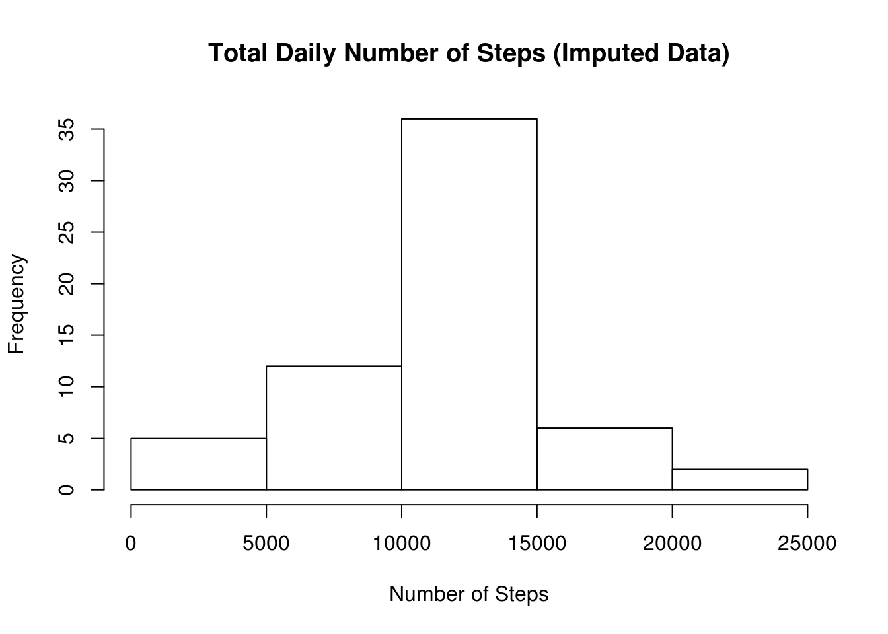
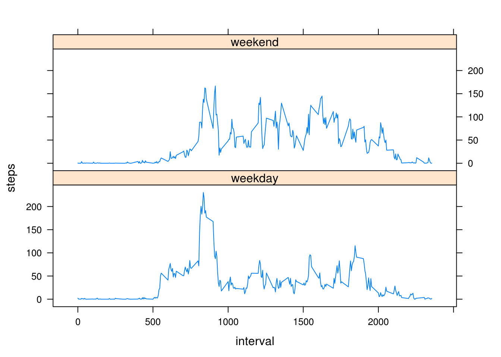

## Loading and preprocessing the data

Show any code that is needed to load the data:


```r
csv_file <- "activity.csv" 

if (!exists(csv_file))
{
    unzip('activity.zip')
}

df <- read.csv(csv_file)
```

## What is mean total number of steps taken per day?

1. Calculate the total number of steps taken per day

```r
steps <- aggregate(steps ~ date, df, sum, na.rm = TRUE)$steps
```

2. Make a histogram of the total number of steps taken each day

```r
hist(steps, 
     main = "Total Daily Number of Steps", 
     xlab = "Number of Steps")
```



3. Calculate and report the mean and median of the total number of steps taken per day

```r
mean(steps)
```

```
## [1] 10766.19
```

```r
median(steps)
```

```
## [1] 10765
```

## What is the average daily activity pattern?

1. Make a time series plot of the 5-minute interval (x-axis) and the average number of steps taken, averaged across all days (y-axis)

```r
avg_steps_per_interval <- aggregate(steps ~ interval, df, mean, na.rm = TRUE)

with(avg_steps_per_interval, 
     plot(interval, 
          steps, 
          type="l", 
          main="Average daily number of steps in each interval"
     )
)
```



2. Which 5-minute interval, on average across all the days in the dataset, contains the maximum number of steps?

```r
max(avg_steps_per_interval$steps)
```

```
## [1] 206.1698
```

## Imputing missing values

1. Calculate and report the total number of missing values in the dataset (i.e. the total number of rows with NAs)

```r
sum(is.na(df$steps))
```

```
## [1] 2304
```

2. Devise a strategy for filling in all of the missing values in the dataset. The strategy does not need to be sophisticated. For example, you could use the mean/median for that day, or the mean for that 5-minute interval, etc.

Given the high variability observed in the average daily activity, filling in with the mean for the respective time interval seems the most appropriate. Values will be rounded to the nearest integer to preserve the physical meaning of the number of steps.

3. Create a new dataset that is equal to the original dataset but with the missing data filled in.

```r
df_noNAs <- transform(df, 
                      steps = ifelse(is.na(df$steps), 
                                     round(avg_steps_per_interval$steps[
                                               match(df$interval, 
                                                     avg_steps_per_interval$interval)
                                           ]
                                     ),
                                     df$steps))

steps_noNAs <- aggregate(steps ~ date, df_noNAs, sum, na.rm = TRUE)$steps
```

4. Make a histogram of the total number of steps taken each day

```r
hist(steps_noNAs,
     main = "Total Daily Number of Steps (Imputed Data)",
     xlab = "Number of Steps")
```



5. Calculate and report the mean and median total number of steps taken per day. Do these values differ from the estimates from the first part of the assignment? What is the impact of imputing missing data on the estimates of the total daily number of steps?

```r
mean(steps_noNAs)
```

```
## [1] 10765.64
```

```r
median(steps_noNAs)
```

```
## [1] 10762
```
These values are slightly lower than the values computed from the set that ommitted NAs. 

## Are there differences in activity patterns between weekdays and weekends?

1. Create a new factor variable in the dataset with two levels – “weekday” and “weekend” indicating whether a given date is a weekday or weekend day.

```r
is_weekday <- function(d) {
    wd <- weekdays(as.Date(d))
    ifelse (wd == "Saturday" | wd == "Sunday", "weekend", "weekday")
}

df_noNAs$dayType <- as.factor(sapply(df_noNAs$date, is_weekday))

aggregated_by_dayType_and_interval <- aggregate(steps ~ dayType+interval, df_noNAs, mean)
```

2. Make a panel plot containing a time series plot of the 5-minute interval (x-axis) and the average number of steps taken, averaged across all weekday days or weekend days (y-axis). 

```r
library(lattice)

with(aggregated_by_dayType_and_interval, 
    xyplot(steps~interval | factor(dayType), layout=c(1,2), type="l")
)
```



There are clear differences between weekdays and weekends. During the week, people wake up earlier and prefer to exercise in the morning before work/school, with a small number execising during lunch or after work. In weekends, exercise patterns are more spread out, with a significant number keeping their morning exercise habit.

Cleanup:

```r
file.remove(csv_file)
```
